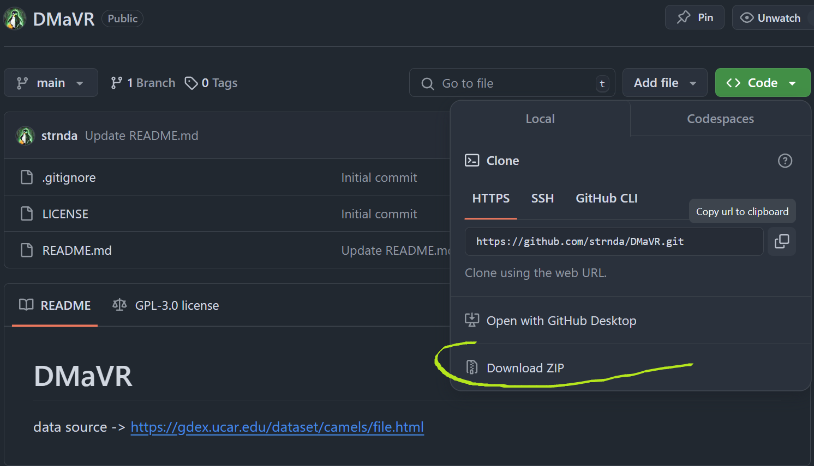
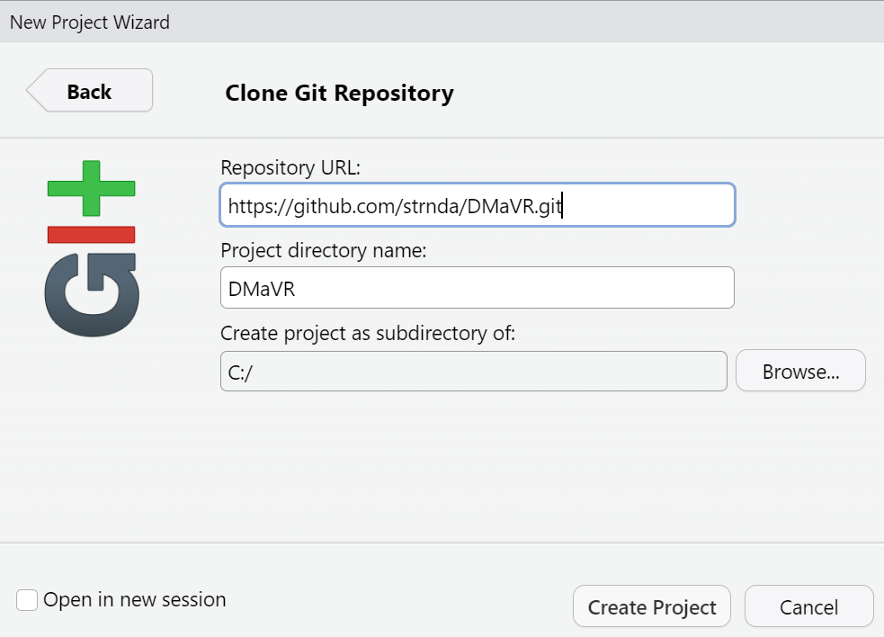

<!-- README.md is generated from README.Rmd. Please edit that file -->

# Data manipulation and visualization in R

Collection of scripts and data for the **DMaVR** class

**Valid (2025-03-06)
[Datacamp](https://www.datacamp.com/groups/shared_links/ccc4fb8cd007ffd95abe048c5325c5f2138f02ca0c13e1aa16ad6c077e532fdd)
invite link**

## How to get the content of tis repo to your local machine

- without git:

``` r
## using R

if (!require(curl)) {
  install.packages(curl)
}
require(curl)


## Download the archive with all files in the repository
## (destfile is location of the future file)
dir.create(path = "./data/",
           showWarnings = FALSE,
           recursive = TRUE)
curl_download(url = "https://github.com/strnda/PED/archive/refs/heads/main.zip", 
              destfile = "./data/test.zip")

## unzip the archive
unzip(zipfile = "./data/test.zip",
      overwrite = TRUE, 
      exdir = "./data/")
```

Or manualy download the archive… 

- with git

``` bash
## using bash (git) commands
git clone https://github.com/strnda/PED.git

## or with ssh
git@github.com:strnda/DMaVR.git
```

Or clone it manually via Rstudio ide interface: navigate to “New
Project” \> “Version Control” \> “git” and paste the repo URL  


# Content of the repository

- In the **R** folder you can find important scripts named in logical
  order (1 - data import, 2 - basic data analysis, etc…)  
- **cheatshees** folder contains cheat sheets that can be useful in your
  future endeavors

# Data for the **DMaVR** class

data source can be found
[here](https://gdex.ucar.edu/dataset/camels/file.html)

# Class Evaluation    

In order to pass the class you have to submit at least **three** out of four assingments in form of a working and well commented script.  
The assignments and a guide on how to upload them can be found in the repo
[wiki](https://github.com/strnda/DMaVR/wiki)
